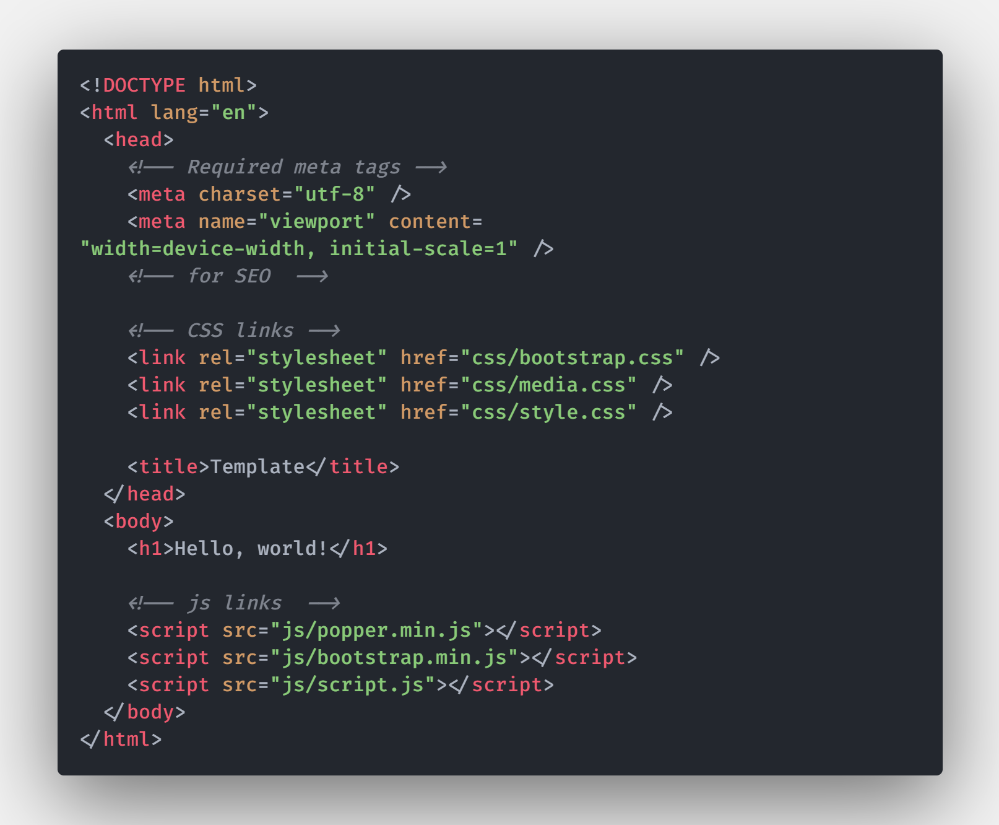

# HTML Starter Template

starter template for html, css, bootstrap 5, javascript projects with file link ups.


## FEATURES

- ```HTML file linkup```
- ```CSS file linkup```
- ```JavaScript file linkup```
- ```Bootstrap file linkup```

## How to get started

```javascript
1) Downlod the zip file.
2) Unzip downloaded zip file.
3) Start working on it.
```


## Tools Used

```HTML5, CSS3, BOOTSTRAP, JS```


## Screenshots




## AUTHOR

[@kawsersimanto](https://www.github.com/kawsersimanto)

